# VexarDrive Fleet Ping Service

*A fleet-tracking backend built to demonstrate end-to-end DevOps maturity — containerized, secured, validated, and defined as Infrastructure as Code for Azure, with an explicit line drawn between what's been run and what's been written.*

      

> **Assessment note:** The Azure infrastructure and deployment workflow are fully implemented in Terraform and GitHub Actions, but were never applied against a live Azure subscription — none was available during this project. Every application, Docker, Terraform, Git, and container-security control below **was validated locally**. See [Project Status and Scope](#project-status-and-scope) for the full breakdown.

---

## Table of Contents

- [Overview](#overview)
- [What This Project Demonstrates](#what-this-project-demonstrates)
- [Quick Start](#quick-start)
- [Architecture](#architecture)
- [API Reference](#api-reference)
- [Docker and Containerization](#docker-and-containerization)
- [Infrastructure as Code (Terraform)](#infrastructure-as-code-terraform)
- [Azure Architecture (Target Platform)](#azure-architecture-target-platform)
- [Security](#security)
- [CI/CD Pipeline](#cicd-pipeline)
- [Security Scanning (Trivy)](#security-scanning-trivy)
- [Testing and Validation](#testing-and-validation)
- [Monitoring and Observability](#monitoring-and-observability)
- [Cost Optimization](#cost-optimization)
- [Project Status and Scope](#project-status-and-scope)
- [Roadmap](#roadmap)
- [Key Engineering Decisions](#key-engineering-decisions)
- [Documentation](#documentation)
- [Screenshots](#screenshots)
- [Interview Explanation](#interview-explanation)
- [AI Assistance](#ai-assistance)
- [License](#license)
- [Author](#author)

---

## Overview

Fleet Ping Service is a backend for a fleet-tracking platform: driver authentication, vehicle/telemetry APIs, and admin operations on top of PostgreSQL. The DevOps layer wrapped around it — Docker, Terraform, GitHub Actions, and a target Azure architecture — is the actual point of the project: a demonstration of taking an application from `npm start` to a reproducible, secured, observable cloud deployment.

A production platform needs more than working code: reproducible infrastructure, container hardening, secrets management, CI/CD automation, vulnerability scanning, health/readiness checks, monitoring, environment separation, and operational documentation. This repository implements all of it, and is explicit about which parts were exercised end-to-end locally versus defined as code and validated statically, since no Azure subscription was available at build time.

## What This Project Demonstrates

| Layer | Implementation |
|---|---|
| Application | Node.js + Express |
| Database | PostgreSQL |
| Authentication | JWT |
| Containerization | Docker |
| Local Orchestration | Docker Compose |
| Infrastructure | Terraform |
| Cloud Platform | Microsoft Azure |
| Container Platform | Azure Container Apps |
| Image Registry | Azure Container Registry |
| Database Platform | PostgreSQL Flexible Server |
| Networking | Azure VNet + Subnets + NSGs |
| Secrets | Azure Key Vault |
| Identity | Managed Identity |
| Authorization | Azure RBAC |
| CI/CD | GitHub Actions |
| Azure Authentication | GitHub OIDC |
| Security Scanning | Trivy |
| Monitoring | Azure Monitor |
| Logging | Log Analytics |
| Application Telemetry | Application Insights |
| DNS | Private DNS |
| Documentation | Markdown |

---

## Quick Start

### Prerequisites
- Node.js (LTS) and npm
- Docker Engine and Docker Compose
- Terraform CLI — only needed to validate the infrastructure code locally
- Git

**1. Clone and configure**
```bash
git clone https://github.com/dankbhardwaj/devops-assessment.git
cd devops-assessment
```

**2. Set environment variables**

Create a `.env` file (or export these in your shell) before starting the app:

| Variable | Description | Example |
|---|---|---|
| `PORT` | Port the Express server listens on | `3000` |
| `DB_HOST` | PostgreSQL host | `localhost`, or the Compose service name (e.g. `postgres`) when running via Docker Compose |
| `DB_PORT` | PostgreSQL port | `5432` |
| `DB_NAME` | Database name | `fleetping` |
| `DB_USER` | Database user | `fleetuser` |
| `DB_PASSWORD` | Database password | set locally — never commit |
| `JWT_SECRET` | Secret used to sign and verify JWTs | set locally — never commit |

**3. Run with Docker Compose**
```bash
docker compose up -d --build
docker compose ps
```
Both the application and PostgreSQL containers should report healthy.

**4. Verify the app is up**
```bash
curl -i --max-time 10 http://localhost:3000/health
curl -i --max-time 10 http://localhost:3000/ready
```

**5. Run application checks**
```bash
npm test
```

---

## Architecture

The system splits into three layers: the Express application, the container/orchestration layer (Docker Compose locally, Azure Container Apps as the deployment target), and the data layer (PostgreSQL, accessed through connection pooling and parameterized queries).

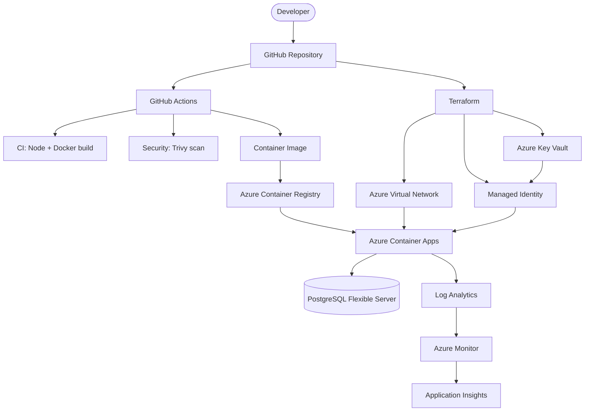

### Request Flow

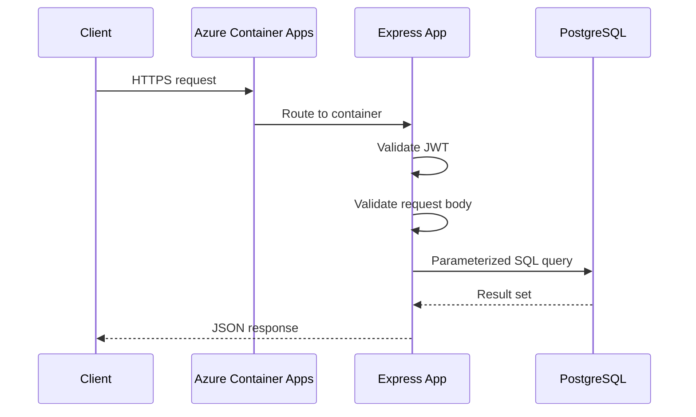

### Health and Readiness

The application separates *liveness* from *readiness* so the platform can tell "the process is up" apart from "the app can actually serve traffic."

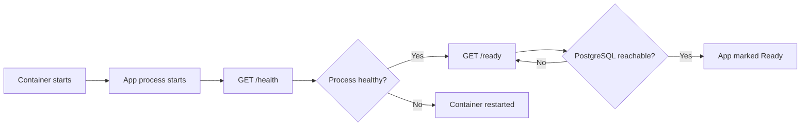

---

## API Reference

### Health and Readiness

| Endpoint | Method | Auth | Description |
|---|---|---|---|
| `/health` | GET | No | Confirms the application process is running |
| `/ready` | GET | No | Confirms the application can reach PostgreSQL |

**Health response**
```json
{
  "status": "UP",
  "service": "fleet-ping-service",
  "timestamp": "..."
}
```

**Readiness response**
```json
{
  "status": "READY",
  "database": "connected"
}
```

### Application Routes

| Category | Method(s) | Auth | Purpose |
|---|---|---|---|
| Authentication | POST | No (issues a JWT) | Driver login / JWT credential issuance |
| Fleet | GET / POST | Yes (JWT) | Vehicle location and telemetry operations |
| Administration | GET / POST | Yes (JWT) | Protected administrative operations |

*Exact route paths live in the Express route handlers — fill in the specific paths here as the API surface grows (e.g. `/api/auth/login`, `/api/fleet/vehicles`).*

---

## Docker and Containerization

The image is built in two stages so build-time tooling never ships in the runtime container.

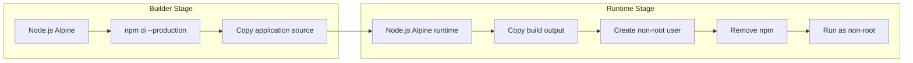

**Builder stage:** Node.js Alpine base, installs production dependencies with `npm ci`, copies the application source.

**Runtime stage:** Node.js Alpine base, copies the built app from the builder stage, creates a dedicated non-root application user, removes `npm` from the image entirely, and runs as that non-root user.

### Docker Compose (Local Development)

Docker Compose runs the app and PostgreSQL as separate services on a shared Docker network. The app reaches the database through the Compose **service name** rather than `localhost`, which keeps the local setup close to how it behaves in a real containerized environment.

### Container Hardening

- Multi-stage build keeps build dependencies out of the final image
- Alpine-based runtime image
- Runs as a dedicated non-root user (verified)
- `npm` removed from the runtime image (verified)
- Docker health check configured
- Only production dependencies installed
- Minimal runtime filesystem contents

---

## Infrastructure as Code (Terraform)

All infrastructure is defined under `terraform/`:

```text
Resource Group
  └─ Virtual Network
       ├─ Container Apps Subnet → Azure Container Apps
       └─ PostgreSQL Subnet     → PostgreSQL Flexible Server
  └─ Azure Container Registry
  └─ Azure Key Vault → Managed Identity → Azure RBAC
```

Terraform resources include: Resource Group, Virtual Network, Subnets, Network Security Groups, Azure Container Registry, Azure Container Apps Environment, Azure Container App, PostgreSQL Flexible Server + database, Private DNS, Azure Key Vault, Managed Identity, RBAC assignments, Log Analytics, Azure Monitor, and alert rules.

### Environment Strategy

```text
terraform/environments/
├── dev/terraform.tfvars
├── stage/terraform.tfvars
└── prod/terraform.tfvars
```

The same Terraform modules support development, staging, and production by swapping the var file:

```bash
terraform -chdir=terraform plan -var-file=environments/dev/terraform.tfvars
```

### Validation

```bash
terraform -chdir=terraform fmt -check -recursive
terraform -chdir=terraform validate
```
```text
Success! The configuration is valid.
```

No `terraform apply` was run against live Azure resources — see [Project Status and Scope](#project-status-and-scope).

---

## Azure Architecture (Target Platform)

| Service | Role |
|---|---|
| Azure Container Apps | Hosts the containerized app — HTTPS ingress, health monitoring, revisions, scaling |
| Azure Container Registry | Stores built container images |
| PostgreSQL Flexible Server | Managed PostgreSQL, on its own subnet |
| Azure Key Vault | Stores `postgres-password` and `jwt-secret` |
| Managed Identity | Authenticates the app to Azure without long-lived credentials |
| Azure RBAC | Scopes access to ACR, Key Vault, and other resources |
| Private DNS | Internal name resolution within the VNet |

Intended image flow:
```text
GitHub Actions → Docker Build → Azure Container Registry → Azure Container Apps
```

---

## Security

### Application-Level
- **JWT authentication** on protected endpoints
- **Parameterized SQL** — `SELECT * FROM drivers WHERE phone = $1;` — keeps user input out of the query itself
- **Environment-based configuration** — see the variable table in [Quick Start](#quick-start)
- **Request validation** runs before business logic

### Secrets and Identity (Target Azure Model)

Secrets (`postgres-password`, `jwt-secret`) are designed to live in Azure Key Vault, accessed by the app through Managed Identity, scoped by RBAC:

```text
Azure Key Vault → Managed Identity → Azure RBAC → Container Application
```

No production secret is committed to Git; local development uses environment configuration instead.

---

## CI/CD Pipeline

Three workflows live under `.github/workflows/`:

| Workflow | Purpose |
|---|---|
| `ci.yml` | Node.js validation, Docker build, Terraform `fmt`/`validate` |
| `security.yml` | Trivy vulnerability scan |
| `deploy.yml` | Build → push to ACR → deploy to Azure Container Apps *(target — not yet run live)* |

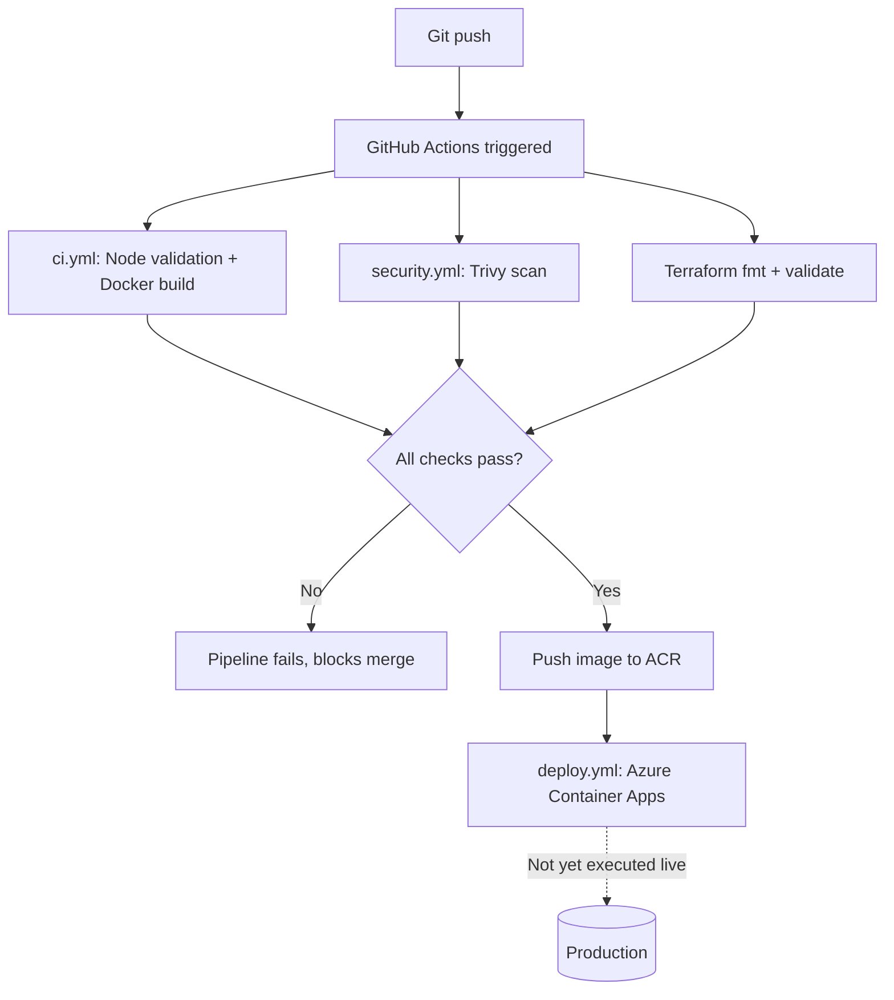

### GitHub OIDC

The deployment is designed to authenticate to Azure using GitHub's OIDC token exchange instead of storing long-lived Azure credentials as GitHub secrets:

```text
GitHub Actions → GitHub OIDC Token → Azure Identity → Azure Resources
```

---

## Security Scanning (Trivy)

```bash
trivy image --scanners vuln --severity HIGH,CRITICAL devops-assessment-app:latest
```

An early scan flagged vulnerabilities in packages bundled with `npm` itself inside the Node.js runtime image — not application dependencies:

```text
tar
brace-expansion
ip-address
picomatch
sigstore
```

Since the running application never calls `npm`, it was removed from the runtime stage entirely. Re-scanning the rebuilt image came back clean:

```text
Total: 0 (HIGH: 0, CRITICAL: 0)
```

---

## Testing and Validation

```bash
# Application syntax validation
npm test

# Build and start containers
docker compose up -d --build
docker compose ps

# Health check
curl -i --max-time 10 http://localhost:3000/health

# Readiness check (verifies PostgreSQL connectivity)
curl -i --max-time 10 http://localhost:3000/ready

# Terraform validation
terraform -chdir=terraform fmt -check -recursive
terraform -chdir=terraform validate

# Git whitespace validation
git diff --check
```

| Check | Result |
|---|---|
| Node.js syntax validation | PASS |
| Docker build | PASS |
| Docker Compose (app + PostgreSQL) | HEALTHY |
| `/health` endpoint | HTTP 200 |
| `/ready` endpoint | HTTP 200 |
| Database connectivity | PASS |
| `terraform fmt` | PASS |
| `terraform validate` | PASS |
| `git diff --check` | PASS |
| Trivy HIGH vulnerabilities | 0 |
| Trivy CRITICAL vulnerabilities | 0 |
| Non-root container | VERIFIED |
| npm removed from runtime | VERIFIED |

---

## Monitoring and Observability

Target stack: Azure Monitor, Log Analytics, and Application Insights, watching application availability, error rates, response times, container health/restarts, database connectivity, and resource utilization.

```text
Application → Container Apps → Log Analytics + Application Insights → Azure Monitor → Alerts
```

---

## Cost Optimization

Main cost drivers: PostgreSQL Flexible Server, Container Apps compute, Log Analytics ingestion, Application Insights telemetry, and Container Registry storage.

Development-time optimizations: a burstable PostgreSQL SKU, Container Apps scale-to-zero where possible, right-sized CPU/memory, log retention limits, telemetry sampling, image cleanup, and destroying unused Terraform environments. Full detail in [`docs/COST.md`](docs/COST.md).

---

## Project Status and Scope

This project draws a clear line between **what has been run** and **what has been written but not yet run against live Azure resources.**

### Validated Locally
- Node.js application (syntax + runtime)
- PostgreSQL (via Docker Compose)
- Docker build and Docker Compose orchestration
- `/health` and `/ready` endpoints
- Terraform formatting and validation (`fmt`, `validate`)
- Git whitespace validation
- Trivy vulnerability scanning
- Multi-stage Docker build and non-root container
- npm removal from the runtime image
- Environment-based configuration
- Repository and CI/CD workflow structure

### Implemented as Code, Not Yet Deployed
The following exist as Terraform / GitHub Actions definitions but have **not** been provisioned against a live Azure subscription:
- Resource Group, Virtual Network, Subnets, NSGs
- Azure Container Registry
- Azure Container Apps
- PostgreSQL Flexible Server
- Azure Key Vault, Managed Identity, RBAC
- Log Analytics, Azure Monitor, Application Insights
- The GitHub Actions deployment stage (`deploy.yml` → Azure)

### Why No Live Deployment
No Azure subscription was available during this assessment. Rather than mask that gap, the Terraform and CI/CD are written to the same standard as the rest of the project and validated everywhere validation is possible without a subscription (`fmt`, `validate`, static analysis) — the boundary is stated explicitly instead of blurred.

### Known Limitations
- No live Azure subscription — infrastructure has not been provisioned
- No live ACR push — the image was built and scanned locally only
- No live Container Apps deployment — validated through Docker Compose instead
- No production traffic — not tested at production scale

### Status at a Glance

| Component | Status |
|---|---|
| Application | Complete |
| Docker / Docker Compose | Complete |
| Container Hardening | Complete |
| PostgreSQL | Complete |
| Health / Readiness Checks | Complete |
| Terraform | Validated (not applied) |
| Environment Separation (dev/stage/prod) | Complete |
| Trivy Security Scan | Complete |
| GitHub Actions Workflows | Implemented |
| Azure Infrastructure Code | Implemented |
| Azure Live Deployment | Not performed |
| Documentation | Complete |

---

## Roadmap

### Planned Enhancements

**Azure** — live deployment to Container Apps and ACR, production DNS/HTTPS, private endpoints where appropriate.

**CI/CD** — GitHub OIDC federation, protected production environment with required approvals, automated rollback, immutable SHA-tagged image deployments.

**Security** — Microsoft Defender for Cloud, Azure Policy, automated secret rotation, image signing, SBOM generation.

**Reliability** — autoscaling, database backup validation, disaster-recovery testing, graceful shutdown, multi-region architecture if required.

### Next Steps If Azure Becomes Available
1. Configure Azure subscription and Terraform remote backend
2. Provision development infrastructure
3. Create Azure Container Registry and push an immutable image
4. Deploy Azure Container Apps
5. Configure Key Vault, Managed Identity, and RBAC
6. Wire up monitoring and GitHub OIDC
7. Run the CI/CD pipeline end to end
8. Validate health/readiness against the live environment
9. Configure alerts and test rollback

---

## Key Engineering Decisions

| Decision | Why |
|---|---|
| Multi-stage Docker build | Separates build-time dependencies from the runtime image, shrinking the final footprint |
| Non-root container | Reduces the privileges available to the running application process |
| npm removed from runtime | The running app never calls npm; removing it also eliminated every HIGH/CRITICAL Trivy finding |
| PostgreSQL connection pooling | Reuses connections instead of opening a new one per request |
| Parameterized SQL | Keeps user input out of the SQL statement itself, mitigating injection |
| Terraform | Makes the infrastructure reproducible and version-controlled |
| Managed Identity | Avoids embedding long-lived Azure credentials in the app |
| Azure Key Vault | Centralizes secret storage instead of scattering secrets across config |
| GitHub OIDC | Lets GitHub Actions authenticate to Azure without long-lived credentials |
| Health/readiness separation | Lets the platform distinguish "process is up" from "app can actually serve traffic" |

---

## Documentation

| Document | Purpose |
|---|---|
| [`ARCHITECTURE.md`](docs/ARCHITECTURE.md) | Architecture and infrastructure design |
| [`COST.md`](docs/COST.md) | Cost estimation and optimization |
| [`DECISIONS.md`](docs/DECISIONS.md) | Engineering decisions |
| [`DEPLOYMENT.md`](docs/DEPLOYMENT.md) | Deployment procedures |
| [`REPORT.md`](docs/REPORT.md) | Project implementation report |
| [`REVIEW.md`](docs/REVIEW.md) | Implementation review |
| [`RUNBOOK.md`](docs/RUNBOOK.md) | Operations and troubleshooting |
| [`SECURITY.md`](docs/SECURITY.md) | Security architecture |
| [`TODO.md`](docs/TODO.md) | Future improvements |

---

## Screenshots

All screenshots are stored under [`docs/images/`](docs/images/).

**Project structure** — application code, Terraform, CI/CD workflows, and docs
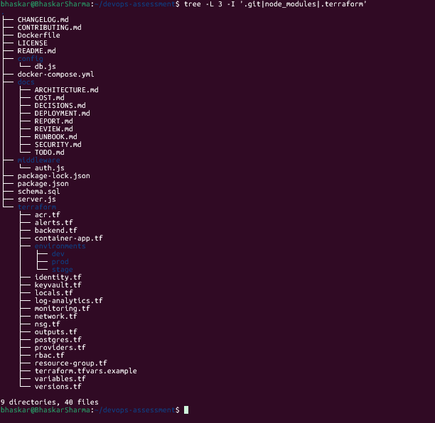

**Application syntax validation** — Node.js files passing the syntax check
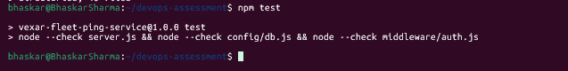

**Docker Compose health** — app and PostgreSQL containers both healthy
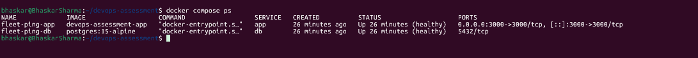

**Health endpoint** — `/health` returning HTTP 200
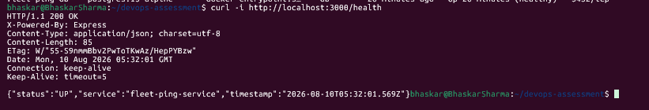

**Database readiness** — `/ready` confirming PostgreSQL connectivity
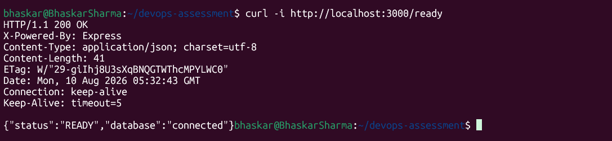

**Terraform validation** — `fmt` and `validate` passing
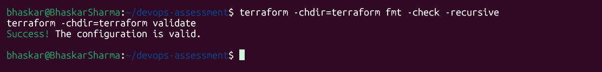

**Git validation** — `git diff --check` clean
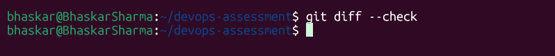

**Trivy security scan** — final image: 0 HIGH, 0 CRITICAL
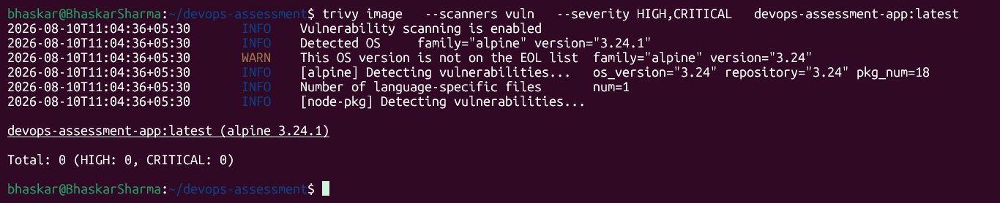

**Container hardening** — non-root user verified, npm removed from runtime
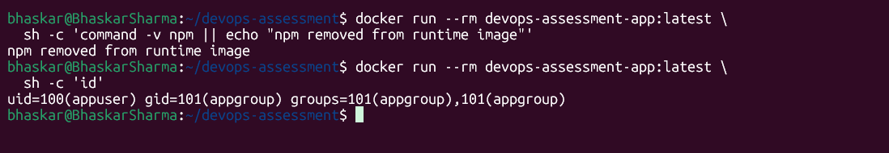

**Final validation** — combined results across all checks


---

## Interview Explanation

> I built a production-oriented DevOps platform for a Node.js fleet-tracking application. I containerized it with a multi-stage Docker build and ran it alongside PostgreSQL through Docker Compose for local development.
>
> For infrastructure, I wrote Terraform for Azure Container Apps, Azure Container Registry, PostgreSQL Flexible Server, VNet/subnets/NSGs, Key Vault, Managed Identity, RBAC, and monitoring — with separate dev, staging, and production configurations, plus GitHub Actions workflows for CI, security scanning, and deployment.
>
> For security, I implemented JWT authentication, parameterized SQL, environment-based configuration, non-root containers, npm removal from the runtime image, and a Key Vault / Managed Identity / RBAC model for secrets. I used Trivy to scan the final image, which came back at zero HIGH and CRITICAL vulnerabilities.
>
> I validated everything locally — Docker Compose, health and readiness endpoints, Terraform formatting/validation, Git checks, and container security scanning — but I didn't do a live Azure deployment, since I didn't have a subscription available. I kept that distinction explicit rather than blurring what I ran against what I only wrote as code.

---

## AI Assistance

AI assistance (ChatGPT) was used as a development and documentation aid — DevOps architecture discussion, Terraform structure review, Docker hardening analysis, CI/CD workflow design, documentation structure, troubleshooting, and interview-oriented explanation.

The actual implementation — commands, local application testing, Docker builds, Terraform validation, Git validation, and security scanning — was executed and verified in the local development environment.

**Trivy** is a security tool, not an AI tool. It was used specifically for container vulnerability scanning and HIGH/CRITICAL detection on the final image.

---

## License

No license file is currently included in this repository. This project is presented as a personal DevOps portfolio / technical assessment. If you want others to be able to reuse the code, consider adding an OSI-approved license such as MIT or Apache-2.0.

---

## Author

**Bhaskar Sharma**
DevOps Engineer — AWS, Azure, Kubernetes, Terraform, CI/CD

GitHub: [github.com/dankbhardwaj](https://github.com/dankbhardwaj)
